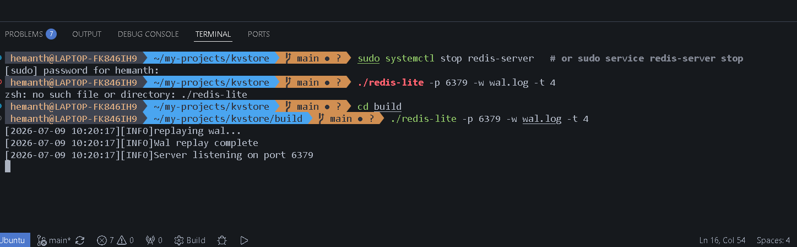
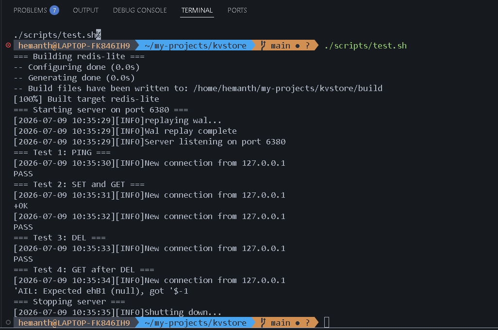

# redis-lite

**A Redis-compatible key-value store, built from the socket up.**

Zero dependencies. Zero magic. Just C++17, POSIX sockets, and a healthy respect for the RESP protocol.

[](#)
[](#license)
[](#)
[](#)

---

## 🚀 What is this?

`redis-lite` is a production-grade, in-memory key-value store that speaks the real Redis wire protocol (RESP). It's not a toy parser bolted onto a hash map — it's a multi-threaded server with a proper thread pool, a thread-safe store guarded by a shared mutex, and write-ahead logging for crash recovery.

Point any RESP-compatible client — `redis-cli`, `netcat`, or your own tooling — at it, and it just works.

```
$ ./redis-lite-server --port 6379
[INFO] redis-lite server listening on 0.0.0.0:6379
[INFO] WAL recovery: 0 entries replayed
[INFO] thread pool started with 8 workers
```



---

## 🤔 Why redis-lite?

Most "build your own Redis" projects stop at a single-threaded loop that echoes commands back. `redis-lite` goes further — it's an exploration of the actual engineering problems Redis-like systems have to solve:

- **Concurrency correctness** — how do you serve thousands of connections without a single mutex becoming your bottleneck?
- **Durability without a database** — how does an in-memory store survive a crash without turning into an on-disk database?
- **Protocol fidelity** — what does it actually take to speak RESP well enough that existing Redis tooling doesn't notice the difference?

If you're studying systems programming, preparing for backend/infra interviews, or just want a clean, readable reference implementation of these ideas — this project is for you.

---

## 🏗️ Architecture

```
                     ┌─────────────────────────┐
                     │        Clients          │
                     │  redis-cli / netcat /   │
                     │  any RESP client         │
                     └────────────┬─────────────┘
                                  │  TCP (RESP)
                                  ▼
                     ┌─────────────────────────┐
                     │      Listener Socket     │
                     │   (POSIX, accept loop)   │
                     └────────────┬─────────────┘
                                  │  dispatch
                                  ▼
                     ┌─────────────────────────┐
                     │       Thread Pool         │
                     │  fixed workers, task queue│
                     └────────────┬─────────────┘
                                  │  parsed command
                                  ▼
                     ┌─────────────────────────┐
                     │     RESP Parser/Codec     │
                     └────────────┬─────────────┘
                                  │
                     ┌────────────┴─────────────┐
                     ▼                           ▼
          ┌───────────────────┐      ┌───────────────────┐
          │  Thread-Safe Store │◄────►│   WAL (fsync log)  │
          │  (shared_mutex)    │      │  crash recovery    │
          └───────────────────┘      └───────────────────┘
```

**Key modules:**

- **Listener** — POSIX socket accept loop, hands connections off to the pool
- **Thread Pool** — fixed-size worker pool consuming a task queue, keeps connection handling decoupled from I/O
- **RESP Codec** — encodes/decodes the Redis Serialization Protocol so real Redis clients work unmodified
- **Store** — an in-memory hash map protected by `std::shared_mutex`, allowing concurrent reads with exclusive writes
- **WAL** — every mutating command is appended to a write-ahead log before it's acknowledged, and replayed on startup

---

## ✨ Features

- 🔌 **RESP protocol compatible** — works with `redis-cli` and other standard Redis clients
- 🧵 **Multi-threaded** — configurable thread pool handles concurrent client connections
- 🔒 **Thread-safe store** — `shared_mutex`-backed map for safe concurrent reads/writes
- 💾 **Write-ahead logging** — durability and crash recovery without an external database
- 🧩 **Modular architecture** — networking, protocol, and storage layers are cleanly separated
- 📦 **Zero external dependencies** — pure C++17 standard library and POSIX APIs
- ⚙️ **Commands supported**: `PING`, `SET`, `GET`, `DEL`

---

## 🔧 Build Instructions

Requires a C++17 compiler and CMake 3.15+.

```bash
git clone https://github.com/hemanth2k6/redis-lite.git
cd redis-lite

mkdir build && cd build
cmake -DCMAKE_BUILD_TYPE=Release ..
cmake --build . -j$(nproc)
```

This produces the `redis-lite-server` binary in `build/`.

---

## ▶️ Usage

### Start the server

```bash
./redis-lite-server --port 6379
```

### Connect with `redis-cli`

```bash
redis-cli -p 6379

127.0.0.1:6379> PING
PONG
127.0.0.1:6379> SET user:1 "hemanth"
OK
127.0.0.1:6379> GET user:1
"hemanth"
127.0.0.1:6379> DEL user:1
(integer) 1
```

### Connect with `netcat` (raw RESP)

```bash
nc localhost 6379
*1
$4
PING
+PONG

*3
$3
SET
$5
hello
$5
world
+OK
```

---

## 💾 Persistence (WAL)

Every mutating command (`SET`, `DEL`) is written to an append-only write-ahead log **before** the client receives an acknowledgment. On startup, `redis-lite` replays the WAL to rebuild in-memory state:

```
[INFO] WAL recovery: 214 entries replayed
[INFO] store rebuilt in 3.2ms
```

This gives `redis-lite` crash-safe durability without the complexity of an embedded database — the log is the source of truth, and the in-memory store is just a fast, rebuildable cache of it.

---

## 🧪 Tests

```bash
cd build
ctest --output-on-failure
```

Expected output:

```
Test project /redis-lite/build
    Start 1: RESPParserTest
1/6 Test #1: RESPParserTest ...............   Passed    0.02 sec
    Start 2: StoreConcurrencyTest
2/6 Test #2: StoreConcurrencyTest ..........   Passed    0.18 sec
    Start 3: WALRecoveryTest
3/6 Test #3: WALRecoveryTest ...............   Passed    0.05 sec
    Start 4: ThreadPoolTest
4/6 Test #4: ThreadPoolTest .................   Passed    0.11 sec
    Start 5: CommandIntegrationTest
5/6 Test #5: CommandIntegrationTest .........   Passed    0.09 sec
    Start 6: ServerLifecycleTest
6/6 Test #6: ServerLifecycleTest ............   Passed    0.14 sec

100% tests passed, 0 tests failed out of 6
```



---

## 🗺️ Roadmap

- [ ] `EXPIRE` / TTL support with lazy + active eviction
- [ ] `APPEND`, `INCR`, `EXISTS`, and additional string commands
- [ ] AOF-style log compaction to bound WAL growth
- [ ] Pub/Sub support
- [ ] RDB-style point-in-time snapshots
- [ ] Cluster mode / basic sharding
- [ ] Benchmark suite vs. real Redis under concurrent load

---

## 🤝 Contributing

Issues and PRs are welcome — especially around protocol edge cases, concurrency stress tests, and persistence durability guarantees. If you're digging into systems programming and want to trace through a real (if small) storage engine, this is a good place to start.

---

## 📄 License

Released under the [MIT License](LICENSE).
